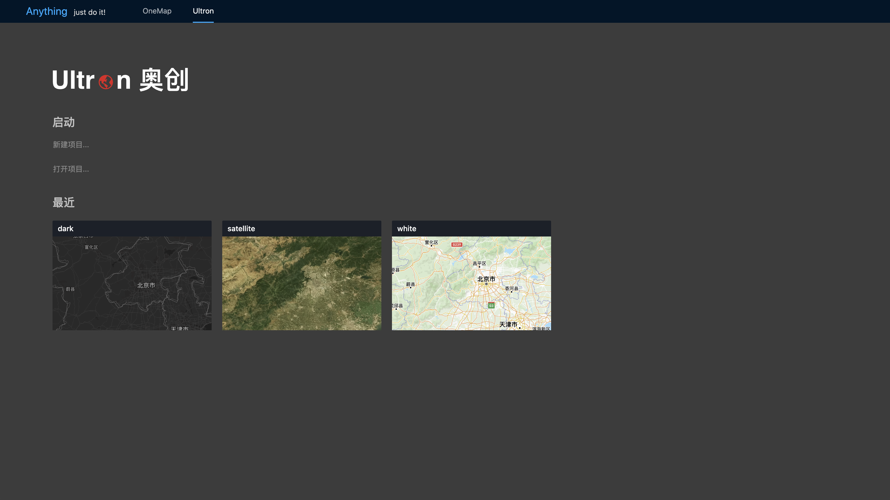

# mapFoundation

友情链接：[支出宝](https://www.zhichubao.com/home)

## 特点

-   整合 webgis 的相关应用实践，不断迭代，与时俱进。
-   webpack 将前端不断出现的新模块、新资源、新需求，进行自动化整合、梳理、输出，使得前端开发者更加专注业务需求
-   微服务架构设计，对 webpack5 模块联邦 的一次应用实践。独立运行、独立开发、独立部署，复杂度可控、容错、高复用
-   router 管理 URL，实现 React 组件的切换，对 6+版本的一次应用实践以及进一步封装
-   Prettier + Eslint 规范代码风格

## 产品架构

### oneMap

git：https://www.npmjs.com/package/eslint

### ultron

git：https://www.npmjs.com/package/eslint

## 技术栈

-   webpack 5.xx
-   react 16.xx
-   react-dom
-   react-router-dom 6.xx
-   antd ui 4.xx

## 开发环境

-   git clone xxx
-   npm install
-   npm start

## 生产环境

-   npm run build
